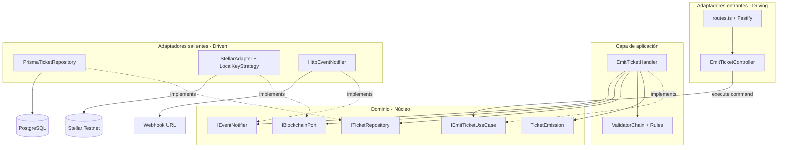
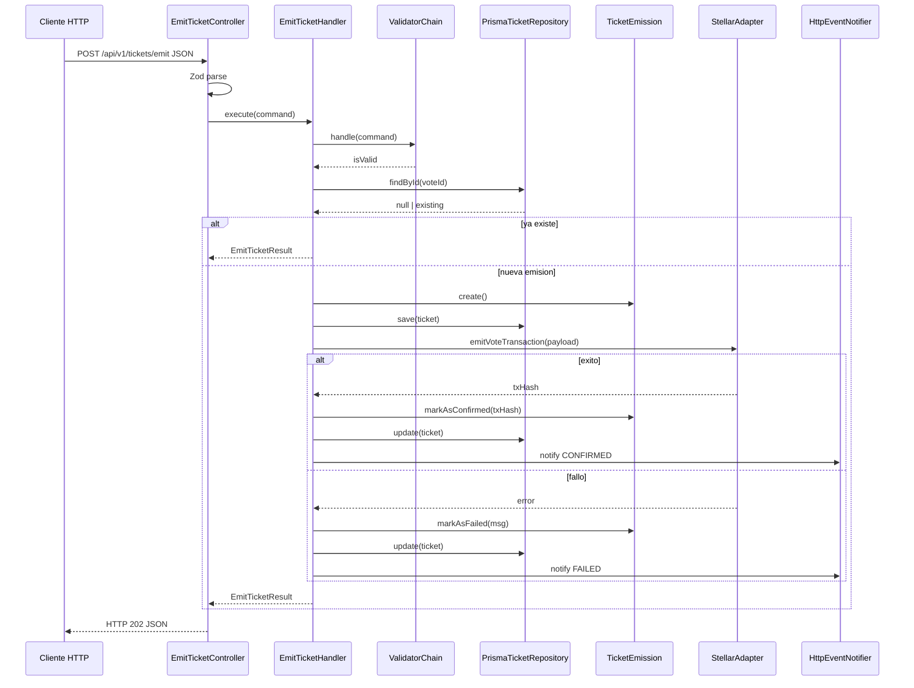
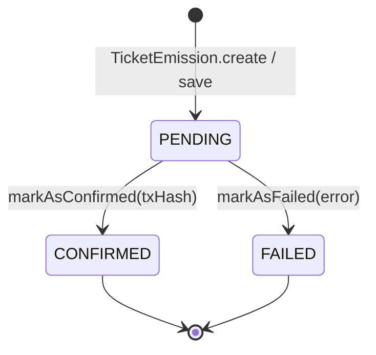

# Informe de arquitectura — Módulo Emisor de Tickets (BVS)

**Proyecto:** Blockchain Voting System (BVS) — curso  
**Módulo documentado:** `bvs-ticket-issuer` (Emisor de Tickets)  
**Arquitectura:** Hexagonal (puertos y adaptadores), formalizada en ADL  
**Versión del informe:** 1.0 — documentación de lo construido (no propuesta teórica)

---

## Objetivo del informe

Este documento describe el **módulo real** que el equipo implementó en el repositorio BVS1.0: el microservicio **Emisor de Tickets**. El análisis se realiza desde la **arquitectura hexagonal** y se formaliza mediante un **Lenguaje de Descripción de Arquitectura (ADL)** propio, alineado con las vistas y conectores típicos de la materia (componentes, puertos, adaptadores y flujos).

La evidencia de implementación reside en:

- Código fuente: `bvs-ticket-issuer/src/` (`domain/`, `application/`, `infrastructure/`)
- Esquema de persistencia: `bvs-ticket-issuer/prisma/schema.prisma`
- Orquestación: `docker-compose.yml` en la raíz del monorepo
- Pruebas unitarias: `bvs-ticket-issuer/src/**/*.test.ts` (Vitest)

---

# Sección 1 — Contexto del módulo

## 1.1 Nombre y propósito

| Elemento | Descripción |
|----------|-------------|
| **Nombre** | Emisor de Tickets (`bvs-ticket-issuer`) |
| **Tipo** | Microservicio independiente dentro del ecosistema BVS |
| **Propósito** | Registrar en blockchain (Stellar Testnet) la emisión de un “ticket” de voto ya validado por el sistema principal, manteniendo un **estado off-chain** auditable y notificando el resultado a otros módulos sin acoplar el núcleo de negocio al SDK de Stellar ni al ORM |

### Problema de negocio que resuelve

En un sistema de votación universitaria con blockchain, no basta con que el backend principal valide al votante: hace falta una **prueba inmutable on-chain** de que se emitió un ticket para un voto concreto, correlacionable con un identificador local (`voteId`) y sin exponer datos personales (PII). El Emisor de Tickets:

1. Recibe una solicitud de emisión con `voteId`, `electionId` y `voterToken` (token anónimo).
2. Persiste el intento en PostgreSQL con estado `PENDING`.
3. Construye, firma y envía una transacción mínima a Stellar (memo con referencia al token).
4. Actualiza el estado a `CONFIRMED` o `FAILED` y notifica por webhook al módulo de Censo KYC (u otro consumidor configurado).

Así se cumple el rol de **puente confiable** entre el backend transaccional y la red distribuida.

### Por qué se eligió este módulo

- Es el único módulo del alcance del curso implementado en este repositorio (`Contexto.md`).
- Concentra integraciones críticas (BD, blockchain, HTTP, webhooks) y obliga a separar dominio de infraestructura.
- Permite demostrar patrones de diseño exigidos: Command, Repository, Adapter, Strategy, Chain of Responsibility y Observer.

---

## 1.2 Alcance y límites

### Dentro del alcance (lo que el equipo construyó)

| Capacidad | Implementación |
|-----------|----------------|
| API REST para emitir ticket | `POST /api/v1/tickets/emit` |
| Health check | `GET /health` |
| Persistencia off-chain del ciclo de vida | Prisma + PostgreSQL (`PENDING` → `CONFIRMED` / `FAILED`) |
| Emisión on-chain en Stellar Testnet | `StellarAdapter` + `LocalKeyStrategy` |
| Notificación de resultado | `HttpEventNotifier` → `WEBHOOK_URL` |
| Validación de entrada (HTTP + negocio) | Zod en controlador; cadena de validadores en aplicación |
| Idempotencia por `voteId` | Consulta previa en repositorio |
| Timeout en llamadas a Stellar | 15 s (`Promise.race` en adaptador) |
| Contenedorización | Docker + Docker Compose |
| Panel de pruebas (cliente) | `bvs-frontend-tester` (MVVM, fuera del hexágono del backend) |

### Fuera del alcance (explícitamente no implementado en este repo)

| Elemento | Motivo |
|----------|--------|
| Módulo **Censo KYC** completo | Solo se simula/notifica vía webhook |
| **Urna Digital** y **Panel de Resultados** | Parte del sistema BVS global; no están en este repositorio |
| Autenticación/autorización del API | El emisor asume solicitudes ya validadas por el backend principal |
| Procesamiento asíncrono en cola (202 fire-and-forget real) | La API responde 202, pero el handler **espera** el resultado de Stellar en la misma petición (decisión de diseño conservadora) |
| Red Stellar pública en producción | Por defecto Testnet; `networkPassphrase` fijado a TESTNET en adaptador |
| Reintentos automáticos con backoff | Fallos se registran como `FAILED`; reintento manual vía nuevo `voteId` o política futura |

### Interacción con otros módulos del sistema BVS


| Módulo / actor | Tipo de interacción | Protocolo / contrato |
|----------------|---------------------|----------------------|
| **Backend principal** (o tester) | Driving — invoca emisión | HTTP JSON: `{ voteId, electionId, voterToken }` |
| **Censo KYC** (destino webhook) | Driven — recibe notificación | HTTP POST: `{ voteId, status, txHash? }` |
| **Stellar Horizon** | Driven — ledger externo | SDK `@stellar/stellar-sdk` |
| **PostgreSQL** | Driven — persistencia | Prisma ORM |
| **bvs-frontend-tester** | Cliente de desarrollo | Proxy Vite → backend; polling Horizon para verificar tx |

---

## 1.3 Atributos de calidad relevantes

Se seleccionan **tres** atributos que condicionaron decisiones concretas en el código (dos obligatorios ampliados con uno transversal de trazabilidad).

### 1.3.1 Modificabilidad (intercambiabilidad)

**Definición:** Facilidad para cambiar implementaciones técnicas sin alterar las reglas de negocio.

**Relevancia en este módulo:** El equipo debe poder sustituir Stellar por otra red, Prisma por otro ORM, o la firma local por HSM/KMS, sin reescribir el caso de uso.

**Decisiones derivadas:**

- Puertos `IBlockchainPort`, `ITicketRepository`, `IEventNotifier` definidos en `domain/ports/out/`.
- `EmitTicketHandler` solo depende de interfaces, no de `StellarAdapter` ni `PrismaTicketRepository`.
- Patrón **Strategy** (`SigningStrategy` / `LocalKeyStrategy`) aislado en `infrastructure/blockchain/strategies/`.
- Composition root único en `src/index.ts` donde se cablean implementaciones concretas.

### 1.3.2 Seguridad (confidencialidad e integridad)

**Definición:** Protección de credenciales, minimización de exposición de datos sensibles e integridad del registro de emisión.

**Relevancia en este módulo:** Se maneja `STELLAR_ISSUER_SECRET`; el voto debe ser **anónimo** (solo `voterToken`, sin PII); los errores no deben filtrar detalles del SDK.

**Decisiones derivadas:**

- Clave secreta solo en variables de entorno (`config/env.ts`), consumida por `LocalKeyStrategy`, nunca persistida en BD.
- Memo on-chain truncado a 28 caracteres del `voterToken` (no se almacenan nombres ni documentos).
- Webhook no envía `errorMessage` al exterior (solo `voteId`, `status`, `txHash` opcional) — ver `HttpEventNotifier`.
- Validación en dos capas: formato (Zod) vs reglas de negocio (cadena de responsabilidad).
- Logs estructurados con Pino sin incluir secretos en mensajes de dominio.

### 1.3.3 Disponibilidad / tolerancia a fallos parcial

**Definición:** Capacidad de degradar de forma controlada ante fallos de red o servicios externos sin dejar estados inconsistentes.

**Relevancia en este módulo:** Stellar puede no responder; el servicio no debe bloquearse indefinidamente ni perder la correlación `voteId` ↔ resultado.

**Decisiones derivadas:**

- Timeout de 15 s en `StellarAdapter` mediante `Promise.race`.
- Transición de entidad a `FAILED` con `errorMessage` persistido off-chain.
- Notificación webhook en éxito y fallo; errores del webhook **no** relanzan excepción al handler (no abortan el flujo ya persistido).
- Idempotencia: reenvío con mismo `voteId` devuelve estado previo sin duplicar emisión on-chain.

---

## 1.4 Stack tecnológico

| Capa | Tecnología | Versión / nota | Ubicación en proyecto |
|------|------------|----------------|----------------------|
| Lenguaje | TypeScript | 5.x | `bvs-ticket-issuer/tsconfig.json` |
| Runtime | Node.js | 20 (Dockerfile) | Contenedor backend |
| Framework HTTP | Fastify | 4.x | `infrastructure/web/` |
| Validación de esquema | Zod | 3.x | `EmitTicketController` |
| Blockchain | @stellar/stellar-sdk | 11.x | `StellarAdapter` |
| Base de datos | PostgreSQL | 15 Alpine | `docker-compose.yml` |
| ORM | Prisma | 5.x | `prisma/schema.prisma` |
| Logging | Pino | 8.x | Fastify logger + handlers/adapters |
| Variables de entorno | dotenv + validación | `config/env.ts` |
| Pruebas | Vitest | 3.x | `*.test.ts`, `npm test` |
| Contenedores | Docker, Docker Compose | Raíz del monorepo | `.devcontainer/` opcional |
| Cliente de prueba | React + Vite | `bvs-frontend-tester` | MVVM, no hexagonal |

---

# Sección 2 — Arquitectura hexagonal del módulo

## 2.0 Formalización ADL (vista estructural)

La siguiente notación ADL describe componentes (**C**), puertos requeridos (**R**) y provistos (**P**), y conectores (**↔**).

```adl
SYSTEM BVS_TicketIssuer_Module {

  COMPONENT DomainCore {
    ENTITY TicketEmission
    ERROR  DomainError, ValidationError
    PORT_IN  IEmitTicketUseCase
    PORT_OUT ITicketRepository, IBlockchainPort, IEventNotifier
    CONSTRAINT no_dependency_on { Fastify, Prisma, StellarSDK, fetch }
  }

  COMPONENT ApplicationLayer {
    HANDLER EmitTicketHandler IMPLEMENTS IEmitTicketUseCase
    VALIDATION ValidatorChain, ValidUUIDFormatValidator, VoterTokenPresentValidator
    DEPENDS_ON DomainCore ONLY
  }

  COMPONENT InfrastructureWeb ADAPTER_DRIVING {
    HTTP FastifyServer, Routes, EmitTicketController
    TRANSLATES HTTP_JSON -> EmitTicketCommand
    TRANSLATES EmitTicketResult -> HTTP_202_JSON
    USES IEmitTicketUseCase
  }

  COMPONENT InfrastructurePersistence ADAPTER_DRIVEN {
    PrismaTicketRepository IMPLEMENTS ITicketRepository
    MAPPING PrismaRow <-> TicketEmission
  }

  COMPONENT InfrastructureBlockchain ADAPTER_DRIVEN {
    StellarAdapter IMPLEMENTS IBlockchainPort
    STRATEGY LocalKeyStrategy : SigningStrategy
  }

  COMPONENT InfrastructureEvents ADAPTER_DRIVEN {
    HttpEventNotifier IMPLEMENTS IEventNotifier
  }

  COMPONENT CompositionRoot {
    WIRES all adapters TO EmitTicketHandler
    FILE index.ts
  }

  CONNECTOR HTTP_REST {
    ENDPOINT POST /api/v1/tickets/emit
    ENDPOINT GET  /health
  }

  CONNECTOR JDBC_like {
    TARGET PostgreSQL.ticket_emissions
  }

  CONNECTOR STELLAR_HORIZON {
    TARGET Stellar.Testnet
  }

  CONNECTOR WEBHOOK_HTTP {
    TARGET env.WEBHOOK_URL
  }

  InfrastructureWeb         --> IEmitTicketUseCase
  EmitTicketHandler         --> ITicketRepository
  EmitTicketHandler         --> IBlockchainPort
  EmitTicketHandler         --> IEventNotifier
  InfrastructurePersistence --> ITicketRepository
  InfrastructureBlockchain  --> IBlockchainPort
  InfrastructureEvents      --> IEventNotifier
  CompositionRoot           --> ALL
}
```

### Vista de despliegue ADL

```adl
DEPLOYMENT TicketIssuer_Deployment {
  NODE container_backend {
    ARTIFACT bvs-ticket-issuer:latest
    EXPOSES port 3000
    ENV DATABASE_URL, STELLAR_ISSUER_SECRET, WEBHOOK_URL, STELLAR_NETWORK
  }
  NODE container_db {
    ARTIFACT postgres:15-alpine
    EXPOSES port 5433 -> 5432
  }
  NODE container_frontend_tester {
    ARTIFACT bvs-frontend-tester
    EXPOSES port 5173
    ROLE development_client_only
  }
  container_backend --> container_db : TCP PostgreSQL
  container_backend --> Stellar_Horizon : HTTPS
  container_backend --> Webhook_Receiver : HTTPS POST
  container_frontend_tester --> container_backend : HTTP /api/*
}
```

### Diagrama hexagonal (vista lógica)



### Regla de dependencias (implementada)

| Capa | Puede importar |
|------|----------------|
| `domain/` | Solo TypeScript estándar y otros archivos de `domain/` |
| `application/` | `domain/` |
| `infrastructure/` | `domain/`, librerías externas (Fastify, Prisma, Stellar, fetch) |
| `index.ts` | `application/`, `infrastructure/`, `config/` |

**Verificación:** ningún archivo en `domain/` importa `@prisma/client`, `@stellar/stellar-sdk`, `fastify` ni `pino`.

---

## 2.1 Descripción del dominio

El **dominio** modela el concepto de negocio **Emisión de Ticket** (`TicketEmission`): un registro lógico que vincula un voto (`voteId`) con un contexto electoral y un token anónimo, y que atraviesa un ciclo de vida finito antes y después de interactuar con la blockchain.

### Entidades

#### `TicketEmission` (`domain/entities/TicketEmission.ts`)

| Atributo (conceptual) | Tipo | Descripción |
|----------------------|------|-------------|
| `voteId` | UUID | Identificador único del voto; clave de idempotencia |
| `electionId` | string | Contexto de la elección activa |
| `voterToken` | string | Referencia anónima al votante (sin PII) |
| `status` | `PENDING` \| `CONFIRMED` \| `FAILED` | Estado del proceso de emisión |
| `txHash` | string \| null | Hash de transacción Stellar si confirmó |
| `errorMessage` | string \| null | Causa de fallo si `FAILED` |

**Factory Method:** `TicketEmission.create(...)` — solo permite nacer en `PENDING` con campos obligatorios.  
**Reconstitute:** `TicketEmission.reconstitute(...)` — reconstruye desde persistencia sin violar invariantes.  
**Comportamiento:** `markAsConfirmed(txHash)`, `markAsFailed(message)` — solo desde `PENDING`.

### Reglas de negocio (invariantes en el dominio)

| ID | Regla | Dónde se aplica |
|----|-------|-----------------|
| RN-01 | Una emisión nueva debe tener `voteId`, `electionId` y `voterToken` | `TicketEmission.create` |
| RN-02 | Solo una emisión en `PENDING` puede pasar a `CONFIRMED` o `FAILED` | `markAsConfirmed`, `markAsFailed` |
| RN-03 | `CONFIRMED` implica `txHash` no nulo | `markAsConfirmed` |
| RN-04 | `FAILED` implica `errorMessage` no nulo | `markAsFailed` |
| RN-05 | Mismo `voteId` no debe procesarse dos veces como nueva emisión | `EmitTicketHandler` + `ITicketRepository.findById` (idempotencia) |

### Casos de uso del núcleo (puerto de entrada)

| Caso de uso | Puerto | Implementación |
|-------------|--------|----------------|
| **Emitir ticket de voto** | `IEmitTicketUseCase.execute(EmitTicketCommand)` | `EmitTicketHandler` |

**Comando de dominio/aplicación (`EmitTicketCommand`):**

```typescript
{ voteId: string; electionId: string; voterToken: string }
```

**Resultado (`EmitTicketResult`):**

```typescript
{ voteId: string; status: string; txHash: string | null; errorMessage: string | null }
```

### Validaciones de negocio (capa aplicación, reglas del dominio)

Orquestadas con **Chain of Responsibility** (`application/validations/`):

| Validador | Regla |
|-----------|-------|
| `ValidUUIDFormatValidator` | `voteId` cumple formato UUID v4 |
| `VoterTokenPresentValidator` | `voterToken` existe y longitud ≥ 10 |

### Por qué el dominio no depende del framework ni de la base de datos

1. **Estabilidad del modelo:** Las reglas RN-01 a RN-04 son invariantes de negocio que no cambian si se migra de Fastify a Express o de PostgreSQL a otro almacén.
2. **Principio de inversión de dependencias (SOLID):** El dominio define *qué* necesita (`ITicketRepository.save`) y la infraestructura define *cómo* (SQL vía Prisma).
3. **Testabilidad:** Tests de `TicketEmission` y `EmitTicketHandler` corren con fakes de puertos, sin Docker ni red (8 tests Vitest).
4. **Portabilidad del núcleo:** El paquete `domain/` podría reutilizarse en otro runtime si se reimplementan adaptadores.

El dominio **no sabe** qué es un `Request` HTTP, un `TransactionBuilder` de Stellar ni un `prisma.ticketEmission.create`.

---

## 2.2 Puertos de entrada (Driving Ports)

Los puertos de entrada definen **cómo el mundo exterior invoca** al módulo sin conocer detalles de transporte.

### `IEmitTicketUseCase` (`domain/ports/in/IEmitTicketUseCase.ts`)

```typescript
export interface IEmitTicketUseCase {
  execute(command: EmitTicketCommand): Promise<EmitTicketResult>;
}
```

| Aspecto | Descripción |
|---------|-------------|
| **Propósito** | Contrato único para “emitir ticket”: encapsula el caso de uso completo |
| **Quién lo implementa** | `EmitTicketHandler` (capa aplicación) |
| **Quién lo consume** | `EmitTicketController` (adaptador HTTP) — depende de la interfaz, no de la clase concreta |
| **Patrón asociado** | **Command** — `EmitTicketCommand` es el DTO inmutable de intención |

**Por qué es un driving port:** La iniciativa de la operación llega desde fuera (cliente HTTP → controlador → `execute`). El dominio/aplicación expone la operación; el exterior la invoca.

---

## 2.3 Puertos de salida (Driven Ports)

Los puertos de salida definen **qué necesita el núcleo del exterior** sin especificar tecnología.

### `ITicketRepository` (`domain/ports/out/ITicketRepository.ts`)

```typescript
export interface ITicketRepository {
  findById(voteId: string): Promise<TicketEmission | null>;
  save(ticket: TicketEmission): Promise<void>;
  update(ticket: TicketEmission): Promise<void>;
}
```

| Aspecto | Descripción |
|---------|-------------|
| **Propósito** | Persistir y recuperar emisiones off-chain |
| **Implementación** | `PrismaTicketRepository` |
| **Patrón** | **Repository** — traduce entre agregado de dominio y modelo relacional |

### `IBlockchainPort` (`domain/ports/out/IBlockchainPort.ts`)

```typescript
export interface IBlockchainPort {
  emitVoteTransaction(payload: EmitTransactionPayload): Promise<string>;
}
```

| Aspecto | Descripción |
|---------|-------------|
| **Propósito** | Registrar el voto en ledger distribuido; retorna `txHash` |
| **Implementación** | `StellarAdapter` |
| **Patrón** | **Adapter** — oculta SDK Stellar detrás de un método de negocio |

### `IEventNotifier` (`domain/ports/out/IEventNotifier.ts`)

```typescript
export interface IEventNotifier {
  notifyEmissionResult(payload: EmissionEventPayload): Promise<void>;
}
```

| Aspecto | Descripción |
|---------|-------------|
| **Propósito** | Informar a sistemas interesados (p. ej. Censo KYC) del resultado |
| **Implementación** | `HttpEventNotifier` |
| **Patrón** | **Observer** (variante notificador) — publicación desacoplada |

---

## 2.4 Adaptadores de entrada (Driving Adapters)

### `EmitTicketController` + Fastify (`infrastructure/web/`)

**Responsabilidad:** Traducir el protocolo HTTP al lenguaje del dominio.

| Paso de traducción | Detalle |
|--------------------|---------|
| Entrada cruda | `FastifyRequest.body` (JSON) |
| Validación de contrato HTTP | Esquema Zod: `voteId` UUID, `electionId` min 1, `voterToken` min 10 |
| Comando de dominio | Objeto compatible con `EmitTicketCommand` pasado a `execute()` |
| Salida | `EmitTicketResult` → JSON con HTTP **202 Accepted** |
| Errores Zod | HTTP **400** con `details` |
| Otros errores (p. ej. `ValidationError`) | HTTP **500** con `message` (comportamiento preservado del MVP) |

**Inversión de dependencias:** El controlador recibe `IEmitTicketUseCase` por constructor; en `index.ts` se inyecta `EmitTicketHandler`.

```typescript
// infrastructure/web/controllers/EmitTicketController.ts (extracto)
const payload = emitSchema.parse(request.body);
const result = await this.emitTicketUseCase.execute(payload);
return reply.status(202).send(result);
```

### `routes.ts` y `server.ts`

- Registran `POST /api/v1/tickets/emit` y `GET /health`.
- Configuran logger Pino a nivel Fastify.

---

## 2.5 Adaptadores de salida (Driven Adapters)

### `PrismaTicketRepository` — protección frente a ORM

| Función | Traducción |
|---------|------------|
| `save` | `TicketEmission` → `prisma.ticketEmission.create` |
| `update` | Estados y `txHash` / `errorMessage` → `update` SQL |
| `findById` | Fila Prisma → `TicketEmission.reconstitute` |

El handler **nunca** importa `@prisma/client`. Si el equipo cambia a TypeORM, solo se reemplaza este adaptador.

### `StellarAdapter` — protección frente a blockchain

| Detalle técnico | Aislamiento |
|-----------------|-------------|
| Carga cuenta Horizon | Dentro del adaptador |
| `TransactionBuilder`, fees, timebounds | Dentro del adaptador |
| Memo texto (28 chars de `voterToken`) | Regla de correlación on-chain |
| Firma | Delegada a `SigningStrategy` (`LocalKeyStrategy` hoy) |
| Timeout 15 s | `Promise.race` — no bloquea el dominio indefinidamente |

El puerto solo expone: “dame payload de negocio, devuélveme hash”.

### `HttpEventNotifier` — protección frente a HTTP cliente

- Serializa payload acotado para webhook.
- Captura errores de red/HTTP y los registra en log **sin** propagar excepción al handler (el estado off-chain ya quedó consistente).

---

## 2.6 Flujo completo de la operación «Emitir ticket»

Operación representativa: **`POST /api/v1/tickets/emit`**

### Datos de entrada (ejemplo)

```json
{
  "voteId": "550e8400-e29b-41d4-a716-446655440000",
  "electionId": "eleccion-rector-2026",
  "voterToken": "abcdefghijklmnopqrstuvwxyz123456"
}
```

### Secuencia paso a paso

| Paso | Capa | Componente | Acción |
|------|------|------------|--------|
| 1 | Infraestructura (entrada) | Fastify + `routes.ts` | Recibe petición HTTP POST |
| 2 | Infraestructura (entrada) | `EmitTicketController` | Valida body con **Zod**; si falla → 400 |
| 3 | Infraestructura → Aplicación | `EmitTicketController` | Construye `EmitTicketCommand` y llama `emitTicketUseCase.execute(command)` |
| 4 | Aplicación | `EmitTicketHandler` | Log de inicio; ejecuta **ValidatorChain** (UUID + token) |
| 5 | Aplicación | `EmitTicketHandler` | Si validación falla → lanza `ValidationError` → 500 en controlador |
| 6 | Aplicación + Puerto salida | `ITicketRepository.findById` → `PrismaTicketRepository` | Busca idempotencia por `voteId` |
| 7 | Aplicación | `EmitTicketHandler` | Si existe → retorna `EmitTicketResult` previo (fin, paso 17) |
| 8 | Dominio | `TicketEmission.create` | Nueva entidad en estado `PENDING` |
| 9 | Aplicación + Puerto salida | `ITicketRepository.save` | Persiste fila `PENDING` en PostgreSQL |
| 10 | Aplicación + Puerto salida | `IBlockchainPort.emitVoteTransaction` → `StellarAdapter` | Construye tx, firma con `LocalKeyStrategy`, envía a Testnet |
| 11a | Éxito blockchain | `TicketEmission.markAsConfirmed(txHash)` | Invariante RN-02, RN-03 |
| 11b | Fallo blockchain | `TicketEmission.markAsFailed(message)` | Timeout u otro error; RN-04 |
| 12 | Aplicación + Puerto salida | `ITicketRepository.update` | Persiste estado final off-chain |
| 13 | Aplicación + Puerto salida | `IEventNotifier.notifyEmissionResult` → `HttpEventNotifier` | POST webhook `CONFIRMED` o `FAILED` |
| 14 | Aplicación | `EmitTicketHandler` | Mapea entidad a `EmitTicketResult` |
| 15 | Infraestructura (entrada) | `EmitTicketController` | Responde HTTP **202** + JSON resultado |
| 16 | Cliente | `bvs-frontend-tester` (opcional) | Muestra logs; puede hacer polling a Horizon por memo |

### Diagrama de secuencia



### Modelo de estados (dominio + persistencia)



---

## 2.7 Patrones de diseño aplicados (resumen)

| Patrón | Rol en el módulo | Ubicación |
|--------|------------------|-----------|
| **Command** | `EmitTicketCommand` + `IEmitTicketUseCase` | `domain/ports/in`, handler |
| **Chain of Responsibility** | Validadores encadenados | `application/validations/` |
| **Factory Method** | Creación segura de `TicketEmission` | `domain/entities/` |
| **Repository** | `ITicketRepository` / `PrismaTicketRepository` | puerto + infra persistence |
| **Adapter** | `StellarAdapter`, `HttpEventNotifier` | infra blockchain / events |
| **Strategy** | `SigningStrategy` / `LocalKeyStrategy` | infra blockchain/strategies |
| **Observer** | Notificación vía `IEventNotifier` | puerto + `HttpEventNotifier` |
| **Composition Root** | Cableado en `index.ts` | raíz `src/` |

---

## 2.8 Estructura física del código (mapa implementado)

```text
bvs-ticket-issuer/src/
├── domain/
│   ├── entities/TicketEmission.ts
│   ├── errors/DomainError.ts, ValidationError.ts
│   └── ports/
│       ├── in/IEmitTicketUseCase.ts
│       └── out/ITicketRepository.ts, IBlockchainPort.ts, IEventNotifier.ts
├── application/
│   ├── commands/EmitTicketCommand.ts
│   ├── handlers/EmitTicketHandler.ts
│   └── validations/ValidatorChain.ts, Rules.ts
├── infrastructure/
│   ├── web/server.ts, routes.ts, controllers/EmitTicketController.ts
│   ├── persistence/prisma.client.ts, PrismaTicketRepository.ts
│   ├── blockchain/StellarAdapter.ts, strategies/
│   └── events/HttpEventNotifier.ts
├── config/env.ts
└── index.ts
```

---

## 2.9 Criterios de verificación de la arquitectura

| Criterio | Estado en el proyecto |
|----------|------------------------|
| Dominio sin dependencias de infraestructura | Cumplido |
| Caso de uso depende solo de puertos | Cumplido (`EmitTicketHandler`) |
| Adaptadores implementan puertos explícitos | Cumplido |
| Mismo contrato HTTP y flujo síncrono Stellar | Cumplido |
| Tests unitarios de dominio y handler con fakes | Cumplido (8 tests) |
| Documentación alineada con código | `explicacion.md`, `design-patterns.md`, este informe |

---

## Referencias del repositorio

| Documento | Contenido |
|-----------|-----------|
| `Contexto.md` | Requisitos y contexto BVS |
| `Plan de Implementación.md` | Estructura hexagonal objetivo |
| `design-patterns.md` | Patrones con actores y flujos |
| `explicacion.md` | Resumen arquitectura backend/frontend |
| `bvs-ticket-issuer/REGRESSION_CHECKLIST.md` | Pruebas manuales sugeridas |

---

*Informe generado como documentación del artefacto implementado por el equipo en BVS1.0 — Módulo Emisor de Tickets.*
