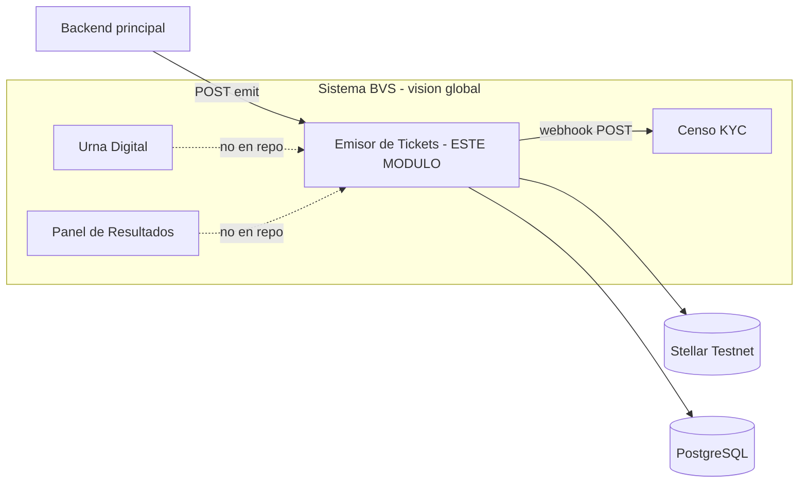
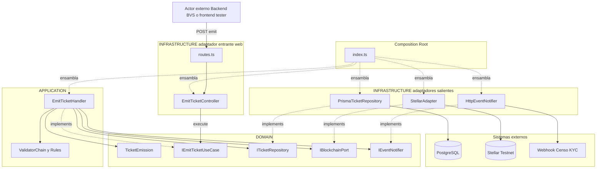
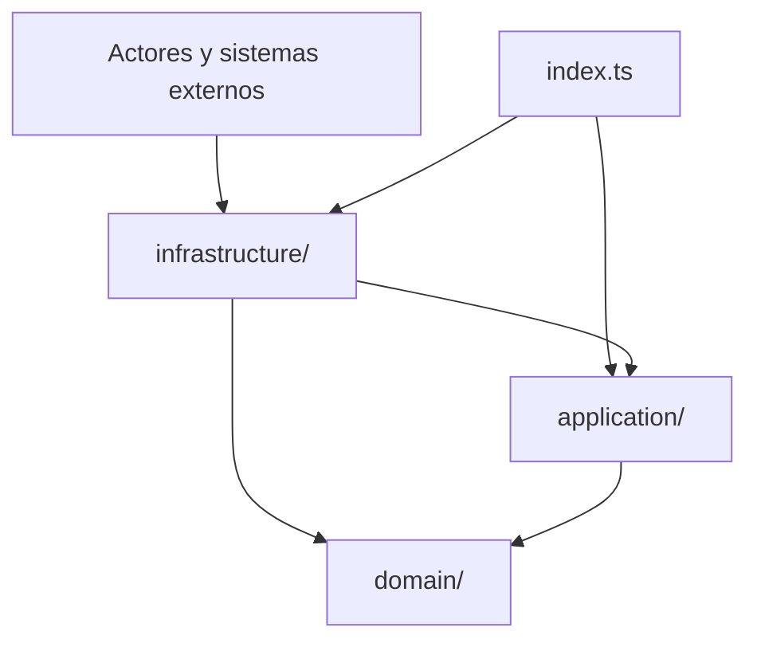
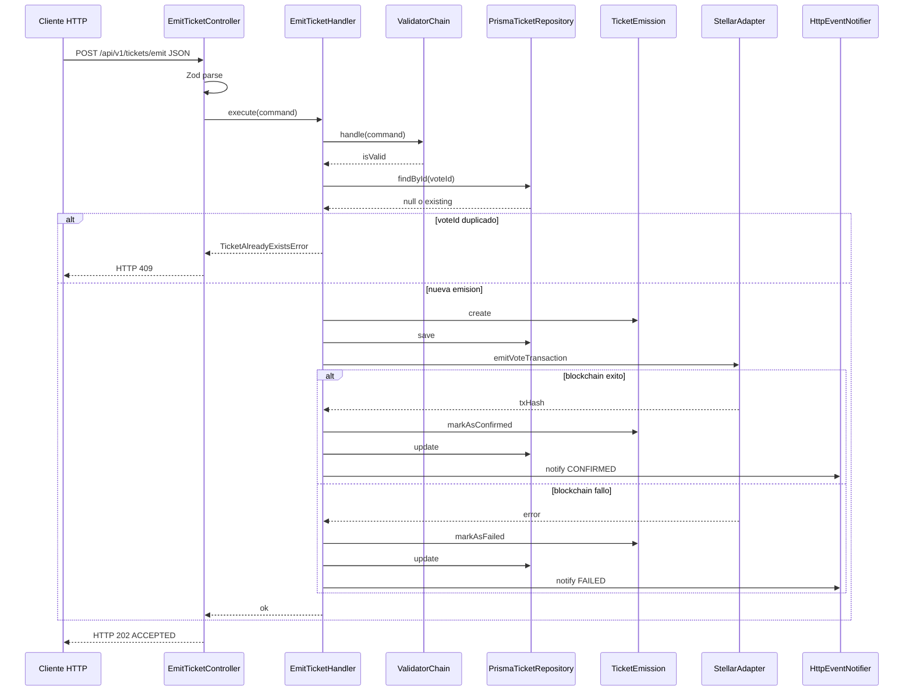
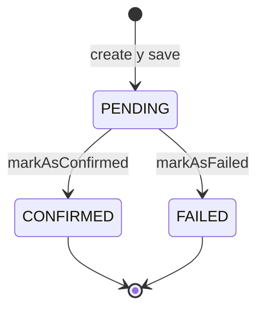

# Informe de arquitectura — Módulo Emisor de Tickets (BVS)

**Proyecto:** Blockchain Voting System (BVS) — curso  
**Módulo documentado:** `bvs-ticket-issuer` (Emisor de Tickets)  
**Arquitectura:** Hexagonal (puertos y adaptadores), formalizada en ADL  
**Versión del informe:** 1.0 — documentación de lo construido (no propuesta teórica)

---

## Objetivo del informe

Este documento describe el **módulo real** que el equipo implementó en el repositorio BVS1.0: el microservicio **Emisor de Tickets**. El análisis se realiza desde la **arquitectura hexagonal** y se formaliza mediante un **Lenguaje de Descripción de Arquitectura (ADL)** propio, alineado con las vistas y conectores típicos de la materia (componentes, puertos, adaptadores y flujos).

La evidencia de implementación reside en:

- Código fuente: `bvs-ticket-issuer/src/` (`domain/`, `application/`, `infrastructure/`)
- Esquema de persistencia: `bvs-ticket-issuer/prisma/schema.prisma`
- Orquestación: `docker-compose.yml` en la raíz del monorepo
- Pruebas unitarias: `bvs-ticket-issuer/src/**/*.test.ts` (Vitest)

---

# Sección 1 — Contexto del módulo

## 1.1 Nombre y propósito


| Elemento      | Descripción                                                                                                                                                                                                                                                             |
| ------------- | ----------------------------------------------------------------------------------------------------------------------------------------------------------------------------------------------------------------------------------------------------------------------- |
| **Nombre**    | Emisor de Tickets (`bvs-ticket-issuer`)                                                                                                                                                                                                                                 |
| **Tipo**      | Microservicio independiente dentro del ecosistema BVS                                                                                                                                                                                                                   |
| **Propósito** | Registrar en blockchain (Stellar Testnet) la emisión de un “ticket” de voto ya validado por el sistema principal, manteniendo un **estado off-chain** auditable y notificando el resultado a otros módulos sin acoplar el núcleo de negocio al SDK de Stellar ni al ORM |


### Problema de negocio que resuelve

En un sistema de votación universitaria con blockchain, no basta con que el backend principal valide al votante: hace falta una **prueba inmutable on-chain** de que se emitió un ticket para un voto concreto, correlacionable con un identificador local (`voteId`) y sin exponer datos personales (PII). El Emisor de Tickets:

1. Recibe una solicitud de emisión con `voteId`, `electionId` y `voterToken` (token anónimo).
2. Persiste el intento en PostgreSQL con estado `PENDING`.
3. Construye, firma y envía una transacción mínima a Stellar (memo con referencia al token).
4. Actualiza el estado a `CONFIRMED` o `FAILED` y notifica por webhook al módulo de Censo KYC (u otro consumidor configurado).

Así se cumple el rol de **puente confiable** entre el backend transaccional y la red distribuida.

### Por qué se eligió este módulo

- Es el único módulo del alcance del curso implementado en este repositorio (`Contexto.md`).
- Concentra integraciones críticas (BD, blockchain, HTTP, webhooks) y obliga a separar dominio de infraestructura.
- Permite demostrar patrones de diseño exigidos: Command, Repository, Adapter, Strategy, Chain of Responsibility y Observer.

---

## 1.2 Alcance y límites

### Dentro del alcance (lo que el equipo construyó)


| Capacidad                                | Implementación                                               |
| ---------------------------------------- | ------------------------------------------------------------ |
| API REST para emitir ticket              | `POST /api/v1/tickets/emit`                                  |
| Health check                             | `GET /health`                                                |
| Persistencia off-chain del ciclo de vida | Prisma + PostgreSQL (`PENDING` → `CONFIRMED` / `FAILED`)     |
| Emisión on-chain en Stellar Testnet      | `StellarAdapter` + `LocalKeyStrategy`                        |
| Notificación de resultado                | `HttpEventNotifier` → `WEBHOOK_URL`                          |
| Validación de entrada (HTTP + negocio)   | Zod en controlador; cadena de validadores en aplicación      |
| Idempotencia por `voteId`                | Consulta previa en repositorio                               |
| Timeout en llamadas a Stellar            | 15 s (`Promise.race` en adaptador)                           |
| Contenedorización                        | Docker + Docker Compose                                      |
| Panel de pruebas (cliente)               | `bvs-frontend-tester` (MVVM, fuera del hexágono del backend) |


### Fuera del alcance (explícitamente no implementado en este repo)


| Elemento                                                   | Motivo                                                                                                                         |
| ---------------------------------------------------------- | ------------------------------------------------------------------------------------------------------------------------------ |
| Módulo **Censo KYC** completo                              | Solo se simula/notifica vía webhook                                                                                            |
| **Urna Digital** y **Panel de Resultados**                 | Parte del sistema BVS global; no están en este repositorio                                                                     |
| Autenticación/autorización del API                         | El emisor asume solicitudes ya validadas por el backend principal                                                              |
| Procesamiento asíncrono en cola (202 fire-and-forget real) | La API responde 202, pero el handler **espera** el resultado de Stellar en la misma petición (decisión de diseño conservadora) |
| Red Stellar pública en producción                          | Por defecto Testnet; `networkPassphrase` fijado a TESTNET en adaptador                                                         |
| Reintentos automáticos con backoff                         | Fallos se registran como `FAILED`; reintento manual vía nuevo `voteId` o política futura                                       |


### Interacción con otros módulos del sistema BVS




| Módulo / actor                   | Tipo de interacción          | Protocolo / contrato                                    |
| -------------------------------- | ---------------------------- | ------------------------------------------------------- |
| **Backend principal** (o tester) | Driving — invoca emisión     | HTTP JSON: `{ voteId, electionId, voterToken }`         |
| **Censo KYC** (destino webhook)  | Driven — recibe notificación | HTTP POST: `{ voteId, status, txHash? }`                |
| **Stellar Horizon**              | Driven — ledger externo      | SDK `@stellar/stellar-sdk`                              |
| **PostgreSQL**                   | Driven — persistencia        | Prisma ORM                                              |
| **bvs-frontend-tester**          | Cliente de desarrollo        | Proxy Vite → backend; polling Horizon para verificar tx |


---

## 1.3 Atributos de calidad relevantes

Se seleccionan **tres** atributos que condicionaron decisiones concretas en el código (dos obligatorios ampliados con uno transversal de trazabilidad).

### 1.3.1 Modificabilidad (intercambiabilidad)

**Definición:** Facilidad para cambiar implementaciones técnicas sin alterar las reglas de negocio.

**Relevancia en este módulo:** El equipo debe poder sustituir Stellar por otra red, Prisma por otro ORM, o la firma local por HSM/KMS, sin reescribir el caso de uso.

**Decisiones derivadas:**

- Puertos `IBlockchainPort`, `ITicketRepository`, `IEventNotifier` definidos en `domain/ports/out/`.
- `EmitTicketHandler` solo depende de interfaces, no de `StellarAdapter` ni `PrismaTicketRepository`.
- Patrón **Strategy** (`SigningStrategy` / `LocalKeyStrategy`) aislado en `infrastructure/blockchain/strategies/`.
- Composition root único en `src/index.ts` donde se cablean implementaciones concretas.

### 1.3.2 Seguridad (confidencialidad e integridad)

**Definición:** Protección de credenciales, minimización de exposición de datos sensibles e integridad del registro de emisión.

**Relevancia en este módulo:** Se maneja `STELLAR_ISSUER_SECRET`; el voto debe ser **anónimo** (solo `voterToken`, sin PII); los errores no deben filtrar detalles del SDK.

**Decisiones derivadas:**

- Clave secreta solo en variables de entorno (`config/env.ts`), consumida por `LocalKeyStrategy`, nunca persistida en BD.
- Memo on-chain truncado a 28 caracteres del `voterToken` (no se almacenan nombres ni documentos).
- Webhook no envía `errorMessage` al exterior (solo `voteId`, `status`, `txHash` opcional) — ver `HttpEventNotifier`.
- Validación en dos capas: formato (Zod) vs reglas de negocio (cadena de responsabilidad).
- Logs estructurados con Pino sin incluir secretos en mensajes de dominio.

### 1.3.3 Disponibilidad / tolerancia a fallos parcial

**Definición:** Capacidad de degradar de forma controlada ante fallos de red o servicios externos sin dejar estados inconsistentes.

**Relevancia en este módulo:** Stellar puede no responder; el servicio no debe bloquearse indefinidamente ni perder la correlación `voteId` ↔ resultado.

**Decisiones derivadas:**

- Timeout de 15 s en `StellarAdapter` mediante `Promise.race`.
- Transición de entidad a `FAILED` con `errorMessage` persistido off-chain.
- Notificación webhook en éxito y fallo; errores del webhook **no** relanzan excepción al handler (no abortan el flujo ya persistido).
- Idempotencia: reenvío con mismo `voteId` devuelve estado previo sin duplicar emisión on-chain.

---

## 1.4 Stack tecnológico


| Capa                  | Tecnología             | Versión / nota        | Ubicación en proyecto              |
| --------------------- | ---------------------- | --------------------- | ---------------------------------- |
| Lenguaje              | TypeScript             | 5.x                   | `bvs-ticket-issuer/tsconfig.json`  |
| Runtime               | Node.js                | 20 (Dockerfile)       | Contenedor backend                 |
| Framework HTTP        | Fastify                | 4.x                   | `infrastructure/web/`              |
| Validación de esquema | Zod                    | 3.x                   | `EmitTicketController`             |
| Blockchain            | @stellar/stellar-sdk   | 11.x                  | `StellarAdapter`                   |
| Base de datos         | PostgreSQL             | 15 Alpine             | `docker-compose.yml`               |
| ORM                   | Prisma                 | 5.x                   | `prisma/schema.prisma`             |
| Logging               | Pino                   | 8.x                   | Fastify logger + handlers/adapters |
| Variables de entorno  | dotenv + validación    | `config/env.ts`       |                                    |
| Pruebas               | Vitest                 | 3.x                   | `*.test.ts`, `npm test`            |
| Contenedores          | Docker, Docker Compose | Raíz del monorepo     | `.devcontainer/` opcional          |
| Cliente de prueba     | React + Vite           | `bvs-frontend-tester` | MVVM, no hexagonal                 |


---

# Sección 2 — Arquitectura hexagonal del módulo

## 2.0 Formalización ADL (vista estructural)

La siguiente notación ADL describe componentes (**C**), puertos requeridos (**R**) y provistos (**P**), y conectores (**↔**).

```adl
SYSTEM BVS_TicketIssuer_Module {

  COMPONENT DomainCore {
    ENTITY TicketEmission
    ERROR  DomainError, ValidationError
    PORT_IN  IEmitTicketUseCase
    PORT_OUT ITicketRepository, IBlockchainPort, IEventNotifier
    CONSTRAINT no_dependency_on { Fastify, Prisma, StellarSDK, fetch }
  }

  COMPONENT ApplicationLayer {
    HANDLER EmitTicketHandler IMPLEMENTS IEmitTicketUseCase
    VALIDATION ValidatorChain, ValidUUIDFormatValidator, VoterTokenPresentValidator
    DEPENDS_ON DomainCore ONLY
  }

  COMPONENT InfrastructureWeb ADAPTER_DRIVING {
    HTTP FastifyServer, Routes, EmitTicketController
    TRANSLATES HTTP_JSON -> EmitTicketCommand
    TRANSLATES EmitTicketResult -> HTTP_202_JSON
    USES IEmitTicketUseCase
  }

  COMPONENT InfrastructurePersistence ADAPTER_DRIVEN {
    PrismaTicketRepository IMPLEMENTS ITicketRepository
    MAPPING PrismaRow <-> TicketEmission
  }

  COMPONENT InfrastructureBlockchain ADAPTER_DRIVEN {
    StellarAdapter IMPLEMENTS IBlockchainPort
    STRATEGY LocalKeyStrategy : SigningStrategy
  }

  COMPONENT InfrastructureEvents ADAPTER_DRIVEN {
    HttpEventNotifier IMPLEMENTS IEventNotifier
  }

  COMPONENT CompositionRoot {
    WIRES all adapters TO EmitTicketHandler
    FILE index.ts
  }

  CONNECTOR HTTP_REST {
    ENDPOINT POST /api/v1/tickets/emit
    ENDPOINT GET  /health
  }

  CONNECTOR JDBC_like {
    TARGET PostgreSQL.ticket_emissions
  }

  CONNECTOR STELLAR_HORIZON {
    TARGET Stellar.Testnet
  }

  CONNECTOR WEBHOOK_HTTP {
    TARGET env.WEBHOOK_URL
  }

  InfrastructureWeb         --> IEmitTicketUseCase
  EmitTicketHandler         --> ITicketRepository
  EmitTicketHandler         --> IBlockchainPort
  EmitTicketHandler         --> IEventNotifier
  InfrastructurePersistence --> ITicketRepository
  InfrastructureBlockchain  --> IBlockchainPort
  InfrastructureEvents      --> IEventNotifier
  CompositionRoot           --> ALL
}
```

### Vista de despliegue ADL

```adl
DEPLOYMENT TicketIssuer_Deployment {
  NODE container_backend {
    ARTIFACT bvs-ticket-issuer:latest
    EXPOSES port 3000
    ENV DATABASE_URL, STELLAR_ISSUER_SECRET, WEBHOOK_URL, STELLAR_NETWORK
  }
  NODE container_db {
    ARTIFACT postgres:15-alpine
    EXPOSES port 5433 -> 5432
  }
  NODE container_frontend_tester {
    ARTIFACT bvs-frontend-tester
    EXPOSES port 5173
    ROLE development_client_only
  }
  container_backend --> container_db : TCP PostgreSQL
  container_backend --> Stellar_Horizon : HTTPS
  container_backend --> Webhook_Receiver : HTTPS POST
  container_frontend_tester --> container_backend : HTTP /api/*
}
```

### Diagrama hexagonal por capas del módulo

El flujo va **de arriba hacia abajo**: entrada HTTP → adaptador driving → aplicación → **dominio (centro)** → adaptadores driven → sistemas externos. La carpeta `infrastructure/` incluye adaptadores **entrantes** (`web/`) y **salientes** (`persistence/`, `blockchain/`, `events/`).

**Figura 2a — Arquitectura por capas (flujo principal)**



**Figura 2b — Dependencias entre capas (vista resumida)**



**Leyenda de flechas**

| Tipo de flecha | Significado |
|----------------|-------------|
| Sólida | Flujo de ejecución o llamada |
| Punteada | `implements` o ensamblaje en `index.ts` |
| Dirección | Siempre hacia el dominio; el dominio no llama a infraestructura |

**Mapa de capas y carpetas**

| Capa | Carpeta | Contenido en este módulo |
|------|---------|-------------------------|
| Composition Root | `src/index.ts` | Instancia adaptadores y handler; registra rutas |
| Infrastructure (driving) | `infrastructure/web/` | Fastify, routes, EmitTicketController |
| Application | `application/` | EmitTicketHandler, ValidatorChain, Rules |
| Domain | `domain/` | TicketEmission, puertos `I*`, DomainErrors |
| Infrastructure (driven) | `infrastructure/persistence/`, `blockchain/`, `events/` | PrismaTicketRepository, StellarAdapter, HttpEventNotifier |
| Externos | — | PostgreSQL, Stellar Horizon, webhook |

**Dirección de dependencias:** `application/` e `infrastructure/` dependen de `domain/`; nunca al revés. Detalle adicional en `infrastructure/blockchain/strategies/`: `LocalKeyStrategy` usado por `StellarAdapter`; `server.ts` configura Fastify.


### Regla de dependencias (implementada)


| Capa              | Puede importar                                                  |
| ----------------- | --------------------------------------------------------------- |
| `domain/`         | Solo TypeScript estándar y otros archivos de `domain/`          |
| `application/`    | `domain/`                                                       |
| `infrastructure/` | `domain/`, librerías externas (Fastify, Prisma, Stellar, fetch) |
| `index.ts`        | `application/`, `infrastructure/`, `config/`                    |


**Verificación:** ningún archivo en `domain/` importa `@prisma/client`, `@stellar/stellar-sdk`, `fastify` ni `pino`.

---

## 2.1 Descripción del dominio

El dominio es el "cerebro" del sistema. Está diseñado de forma agnóstica: no contiene importaciones de Fastify, Prisma ni del SDK de Stellar. Es puro TypeScript de negocio en la carpeta `domain/`.

**Entidades (`TicketEmission`):** Clase que modela el ciclo de vida del ticket (`PENDING`, `CONFIRMED`, `FAILED`). Autovalida invariantes: solo puede pasar de `PENDING` a otro estado; `markAsConfirmed` exige un `txHash`; `markAsFailed` exige un mensaje de error. Se crea con `create()` siempre en `PENDING` y se reconstruye desde BD con `reconstitute()`.

**Reglas de negocio:** En la entidad, toda emisión exige `voteId`, `electionId` y `voterToken`. En aplicación, una cadena de validadores comprueba que `voteId` sea UUID v4 y que `voterToken` tenga al menos 10 caracteres. La idempotencia es por `voteId`: si ya existe un registro, el caso de uso lanza `TicketAlreadyExistsError` (no se reemite en blockchain). Este módulo no consulta censo ni estado "activo" del estudiante; asume que el backend principal ya validó al votante.

**Casos de uso (`EmitTicketHandler`):** Implementa `IEmitTicketUseCase` y coordina la transacción: validación, comprobación de duplicado, persistencia en `PENDING`, llamada a blockchain, actualización a `CONFIRMED` o `FAILED`, y notificación por webhook.

**Justificación de agnosticismo:** Si mañana se cambia el framework HTTP (Fastify por otro) o el ORM, el código de `domain/` y `application/` permanece intacto; los frameworks y SDKs solo actúan como mecanismos de transporte o persistencia en `infrastructure/`.

---

## 2.2 Puertos de entrada (Driving Ports)

Interfaces que exponen las capacidades del núcleo hacia el exterior.

**Puerto identificado:** `IEmitTicketUseCase` (`domain/ports/in/EmitTicketUseCase.ts`).

**Propósito:** Define el contrato formal de emisión. Recibe un `EmitTicketCommand` con `{ voteId, electionId, voterToken }` y ejecuta `execute(command): Promise<void>`. Cualquier adaptador entrante (API REST, script de pruebas) debe acoplarse a esta interfaz, no a la clase `EmitTicketHandler`.

---

## 2.3 Puertos de salida (Driven Ports)

Interfaces que definen cómo el dominio interactúa con almacenamiento y servicios externos.

**Puerto 1 (persistencia):** `ITicketRepository` — `findById`, `save` y `update` sobre la entidad `TicketEmission`. Implementado por `PrismaTicketRepository`.

**Puerto 2 (blockchain):** `IBlockchainPort` — método `emitVoteTransaction(payload)` que devuelve el `txHash` de Stellar. Implementado por `StellarAdapter` (no existe `IGrabadorBlockchain` en este módulo).

**Puerto 3 (notificaciones):** `IEventNotifier` — `notifyEmissionResult` hacia sistemas externos (p. ej. Censo KYC vía webhook). Implementado por `HttpEventNotifier`.

---

## 2.4 Adaptadores de entrada (Driving Adapters)

**Componente:** `EmitTicketController` con **Fastify** (`infrastructure/web/`), no Express.

**Mecanismo de traducción:** Intercepta `POST /api/v1/tickets/emit`, valida el body con **Zod** (`voteId` UUID, `electionId` y `voterToken` obligatorios) y arma el `EmitTicketCommand`. Invoca `IEmitTicketUseCase.execute`. Traduce excepciones a HTTP: `400` (Zod o `ValidationError`), `409` (`TicketAlreadyExistsError`), `502` (`BlockchainBroadcastError`), `500` (resto). En éxito responde **202 Accepted** con `{ status: 'ACCEPTED', message: '...' }`.

El ensamblaje no usa una factoría dedicada: `index.ts` instancia el handler y el controlador e inyecta dependencias de forma manual (composition root).

---

## 2.5 Adaptadores de salida (Driven Adapters)

**Adaptador de base de datos (`PrismaTicketRepository`):** Implementa `ITicketRepository`. Traduce la entidad a operaciones Prisma sobre PostgreSQL (`ticket_emissions`). Oculta SQL, esquema y errores de conexión al caso de uso.

**Adaptador blockchain (`StellarAdapter`):** Implementa `IBlockchainPort`. Gestiona Horizon, construcción de transacción, memo con `voterToken`, firma vía `LocalKeyStrategy` y timeout de 15 s. El dominio solo recibe un `txHash` o un error.

**Adaptador de eventos (`HttpEventNotifier`):** Implementa `IEventNotifier`. Envía POST al `WEBHOOK_URL` con `voteId`, `status` y `txHash` opcional. Los fallos del webhook se registran en log y no revierten el estado ya persistido.

---

## 2.6 Flujo completo de una operación (paso a paso)

Ciclo lineal para `POST /api/v1/tickets/emit` con body `{ voteId, electionId, voterToken }`:

1. **Infraestructura web (entrada):** El cliente envía JSON. Fastify (`server.ts`, `routes.ts`) enruta a `EmitTicketController`.

2. **Adaptación entrante:** El controlador valida con Zod y llama `execute` del puerto `IEmitTicketUseCase`.

3. **Aplicación:** `EmitTicketHandler` ejecuta la cadena `ValidatorChain` (UUID + token). Si falla, lanza `ValidationError`.

4. **Idempotencia:** Consulta `ITicketRepository.findById(voteId)`. Si ya existe, lanza `TicketAlreadyExistsError` → HTTP 409.

5. **Dominio:** `TicketEmission.create()` en estado `PENDING`; `save` en PostgreSQL.

6. **Blockchain:** Invoca `IBlockchainPort.emitVoteTransaction`. `StellarAdapter` firma y publica en Testnet (misma petición HTTP, flujo síncrono).

7. **Éxito on-chain:** `markAsConfirmed(txHash)`, `update` en BD, `IEventNotifier` notifica `CONFIRMED`.

8. **Fallo on-chain:** `markAsFailed`, `update` en BD, notificación `FAILED`, lanza `BlockchainBroadcastError` → HTTP 502.

9. **Salida HTTP:** Si no hubo excepción, el controlador responde **202 Accepted**. El detalle del ticket queda en BD y en el webhook; la respuesta HTTP actual no devuelve el `txHash` en el cuerpo.

### Diagrama de secuencia




### Modelo de estados (dominio + persistencia)




---

## 2.7 Patrones de diseño aplicados (resumen)


| Patrón                      | Rol en el módulo                               | Ubicación                    |
| --------------------------- | ---------------------------------------------- | ---------------------------- |
| **Command**                 | `EmitTicketCommand` + `IEmitTicketUseCase`     | `domain/ports/in`, handler   |
| **Chain of Responsibility** | Validadores encadenados                        | `application/validations/`   |
| **Factory Method**          | Creación segura de `TicketEmission`            | `domain/entities/`           |
| **Repository**              | `ITicketRepository` / `PrismaTicketRepository` | puerto + infra persistence   |
| **Adapter**                 | `StellarAdapter`, `HttpEventNotifier`          | infra blockchain / events    |
| **Strategy**                | `SigningStrategy` / `LocalKeyStrategy`         | infra blockchain/strategies  |
| **Observer**                | Notificación vía `IEventNotifier`              | puerto + `HttpEventNotifier` |
| **Composition Root**        | Cableado en `index.ts`                         | raíz `src/`                  |


---

## 2.8 Estructura física del código (mapa implementado)

```text
bvs-ticket-issuer/src/
├── domain/
│   ├── entities/TicketEmission.ts
│   ├── errors/DomainError.ts, ValidationError.ts
│   └── ports/
│       ├── in/IEmitTicketUseCase.ts
│       └── out/ITicketRepository.ts, IBlockchainPort.ts, IEventNotifier.ts
├── application/
│   ├── commands/EmitTicketCommand.ts
│   ├── handlers/EmitTicketHandler.ts
│   └── validations/ValidatorChain.ts, Rules.ts
├── infrastructure/
│   ├── web/server.ts, routes.ts, controllers/EmitTicketController.ts
│   ├── persistence/prisma.client.ts, PrismaTicketRepository.ts
│   ├── blockchain/StellarAdapter.ts, strategies/
│   └── events/HttpEventNotifier.ts
├── config/env.ts
└── index.ts
```

---

## 2.9 Criterios de verificación de la arquitectura


| Criterio                                       | Estado en el proyecto                                |
| ---------------------------------------------- | ---------------------------------------------------- |
| Dominio sin dependencias de infraestructura    | Cumplido                                             |
| Caso de uso depende solo de puertos            | Cumplido (`EmitTicketHandler`)                       |
| Adaptadores implementan puertos explícitos     | Cumplido                                             |
| Mismo contrato HTTP y flujo síncrono Stellar   | Cumplido                                             |
| Tests unitarios de dominio y handler con fakes | Cumplido (8 tests)                                   |
| Documentación alineada con código              | `explicacion.md`, `design-patterns.md`, este informe |


---

## Referencias del repositorio


| Documento                                   | Contenido                             |
| ------------------------------------------- | ------------------------------------- |
| `Contexto.md`                               | Requisitos y contexto BVS             |
| `Plan de Implementación.md`                 | Estructura hexagonal objetivo         |
| `design-patterns.md`                        | Patrones con actores y flujos         |
| `explicacion.md`                            | Resumen arquitectura backend/frontend |
| `bvs-ticket-issuer/REGRESSION_CHECKLIST.md` | Pruebas manuales sugeridas            |


---

*Informe generado como documentación del artefacto implementado por el equipo en BVS1.0 — Módulo Emisor de Tickets.*